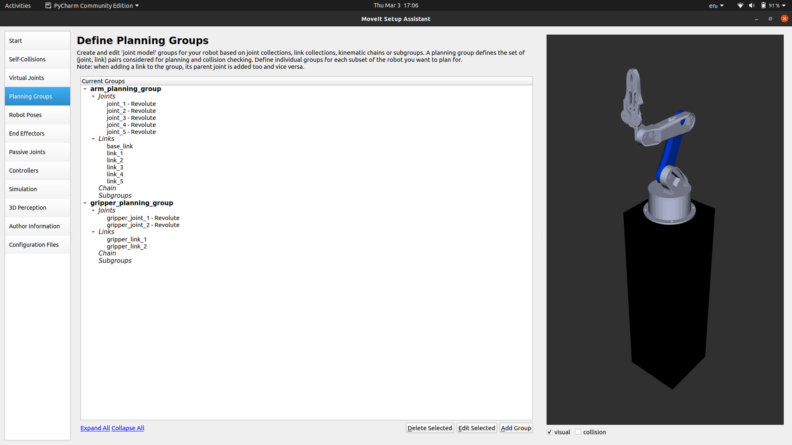
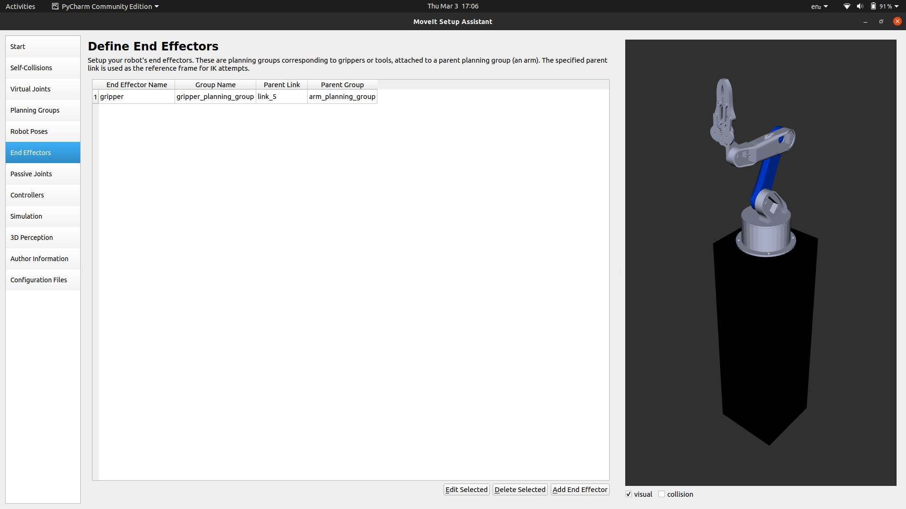
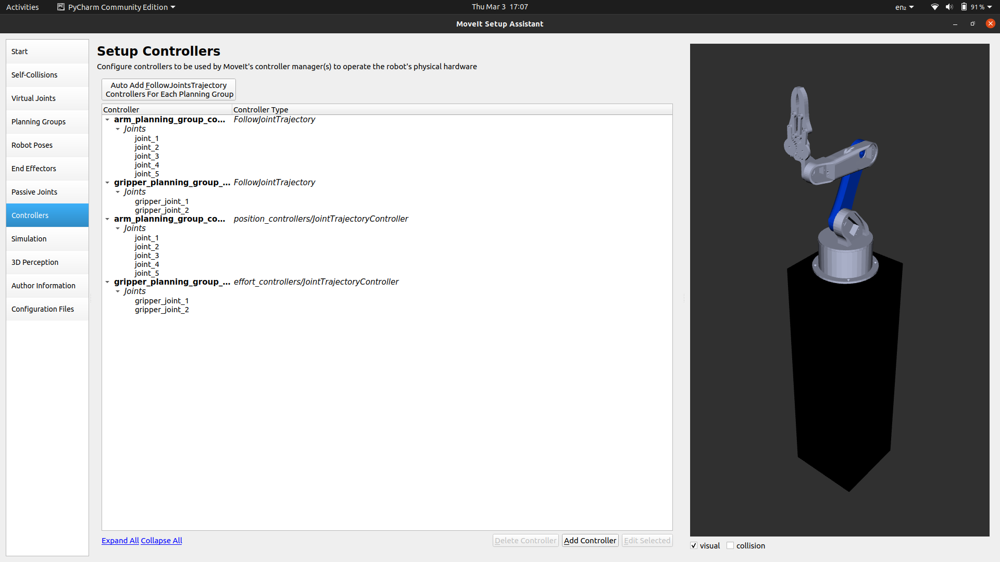

# Requirements:

- Ubuntu 20.04 LTS
- ROS noetic (Desktop Full)
  - follow installation steps here : [wiki.ros.org/noetic/Installation](https://wiki.ros.org/noetic/Installation/Ubuntu)
- SolidWorks
  - Install SolidWorks to URDF exporter : [wiki.ros.org/sw_urdf_exporter](https://wiki.ros.org/sw_urdf_exporter/Tutorials/Export%20an%20Assembly)
- VSCode/Pycharm and Arduino IDE

# Hardware Components

- Arduino UNO
- PCA9685 Servo Controller
- MG996R Servo Motor
- SG90 Micro Servo Motor

### Robot Model designed by _HowToMechatronics_

Model Download link: [thangs.com/HowToMechatronics](https://thangs.com/m/38899)

| SolidWorks Model                                               | Section                                                       |
| -------------------------------------------------------------- | ------------------------------------------------------------- |
|  |  |

### Add to your `.bashrc` file a source to the setup scripts:

```shell
echo "source ~/ros_ws/catkin_ws/devel/setup.bash" >> ~/.bashrc
```

# Create ROS Workspace

```shell
$ mkdir -p ~/ros_ws/catkin_ws/src
$ cd ~/ros_ws/catkin_ws/
$ catkin build
```

if error encountered while `catkin build`, refer : [answers.ros.org/catkin-build](https://answers.ros.org/question/353113/catkin-build-in-ubuntu-2004-noetic)

**ROS Tutorials : [wiki.ros.org/ROS/Tutorials](https://wiki.ros.org/ROS/Tutorials)**

### Create package

```shell
# catkin_create_pkg <package_name> [depend1] [depend2] [depend3]

$ cd ~/ros_ws/catkin_ws/src
$ catkin_create_pkg mums_assistant std_msgs rospy roscpp
```

### URDF

Link

```XML
<link name="link_1">
    <inertial>
        <origin xyz="0.001372 0.0064346 0.017289" rpy="0 0 0" />
        <mass value="0.068038" />
        <inertia ixx="4.5018E-05" ixy="-6.4176E-07" ixz="-6.2428E-06" iyy="5.8133E-05" iyz="-5.1777E-06" izz="5.4676E-05" />
    </inertial>

    <visual>
        <origin xyz="0 0 0" rpy="0 0 0" />
        <geometry>
            <mesh filename="package://mums_assistant/meshes/link_1.STL" />
        </geometry>
        <material name="">
            <color rgba="0.79216 0.81961 0.93333 1" />
        </material>
    </visual>
    <collision>
        <origin xyz="0 0 0" rpy="0 0 0" />
        <geometry>
            <mesh filename="package://mums_assistant/meshes/link_1.STL" />
        </geometry>
    </collision>
</link>
```

Joint

```XML
<joint name="joint_1" type="revolute">
    <origin xyz="0 0 0.056" rpy="0 0 0" />
    <parent link="base_link" />
    <child link="link_1" />
    <axis xyz="0 0 1" />
    <limit lower="-1.57" upper="1.57" effort="0.92" velocity="6.16" />
    <dynamics damping="0" friction="0" />
</joint>
```

Grasp Plugin (for gripper to grip gazebo objects)

- Sources : [gazebo_ros_pkgs](https://github.com/ros-simulation/gazebo_ros_pkgs) | [general-message-pkgs](https://github.com/JenniferBuehler/general-message-pkgs)

- Install : `sudo apt install ros-noetic-object-recognition-msgs`

```XML
<gazebo>
  <plugin name="gazebo_grasp_fix" filename="libgazebo_grasp_fix.so">
    <arm>
    <arm_name>arm</arm_name>
    <palm_link> link_5 </palm_link>
    <gripper_link> gripper_link_1 </gripper_link>
    <gripper_link> gripper_link_2 </gripper_link>
    </arm>
    <forces_angle_tolerance>100</forces_angle_tolerance>
    <update_rate>4</update_rate>
    <grip_count_threshold>4</grip_count_threshold>
    <max_grip_count>8</max_grip_count>
    <release_tolerance>0.005</release_tolerance>
    <disable_collisions_on_attach>false</disable_collisions_on_attach>
    <contact_topic>__default_topic__</contact_topic>
  </plugin>
</gazebo>
```

### Package created using 'Moveit Setup Assistant'

- Launch Moveit Setup Assistant
  - `$ roslaunch moveit_setup_assistant setup_assistant.launch`
- Create New Moveit Configuration Package
  - Load URDF
- Self-Collisions
  - **Generate Collision Matrix**
- Planning Groups
  - 
- Robot Poses
  - rest pose : all arm joint angle = [0 0 0 0 0]
  - gripper_close : gripper joint = [0 0]
  - gripper_open : gripper joint = [-1 -1]
- End Effector
  - 
- Controllers
  - 
- Save package as : `mums_assistant_config`

# World

- Kitchen model in world file

```XML
<model name='kitchen'>
  <static>1</static>
    <link name='kitchen'>
      <visual name='visual'>
          <geometry>
            <mesh>
              <uri>model://Kitchen/meshes/model.dae</uri>
              <scale>0.5 0.5 0.5</scale>
            </mesh>
          </geometry>
      </visual>
      <self_collide>0</self_collide>
      <enable_wind>0</enable_wind>
      <kinematic>0</kinematic>
    </link>
  <pose>-0.804049 0.532603 0 0 0 0</pose>
</model>
```

# Simulation

- Inputs via Rviz:

  https://user-images.githubusercontent.com/42796209/156630172-7028c14f-a111-45b8-9cae-e2dcd7bb42e3.mp4

- Inputs via scripts:

  https://user-images.githubusercontent.com/42796209/156896819-e8eca598-8ca6-4e8a-9198-2fc9c192b345.mp4

- Pick and Place

  https://user-images.githubusercontent.com/42796209/159414752-d892fbff-8e31-4f61-9dca-3697fa60589c.mp4

- Mixing in bowl
  
  

# Code

- Giving Joint angles as Input to reach specific position.

```Python
def set_joint_angles(self, arg_list_joint_angles):

    list_joint_values = self._group.get_current_joint_values()
    rospy.loginfo('\033[94m' + ">>> Current Joint Values:" + '\033[0m')
    rospy.loginfo(list_joint_values)

    self._group.set_joint_value_target(arg_list_joint_angles)
    self._group.plan()
    flag_plan = self._group.go(wait=True)

    if (flag_plan == True):
        rospy.loginfo(
            '\033[94m' + ">>> set_joint_angles() Success" + '\033[0m')
    else:
        rospy.logerr(
            '\033[94m' + ">>> set_joint_angles() Failed." + '\033[0m')

    return flag_plan
```

# Ros-serial

Follow : [wiki.ros.org/rosserial_arduino](https://wiki.ros.org/rosserial_arduino/Tutorials/Arduino%20IDE%20Setup)

---

# 3D Printing Parts

| 1                                                           | 2                                                           | 3                                                           |
| ----------------------------------------------------------- | ----------------------------------------------------------- | ----------------------------------------------------------- |
|  |  |  |

---

# Commands for terminal

```shell
$ source devel/setup.bash
$ roscore
$ rosrun rosserial_python serial_node.py _port:=/dev/ttyACM0 _baud:=115200
$ roslaunch mums_assistant test.launch
$ rosrun mums_assistant testcode.py
$ rosrun mums_assistant joint_servo_publisher_test.py
$ rosrun mums_assistant joint_servo_subscriber_test.py
$ rosrun mums_assistant pick_place_cube.py
$ rosrun mums_assistant mixing_bowl.py <no. of rotation>
```

( if Gazebo dies use this: `killall gzserver and killall gzclient` )
